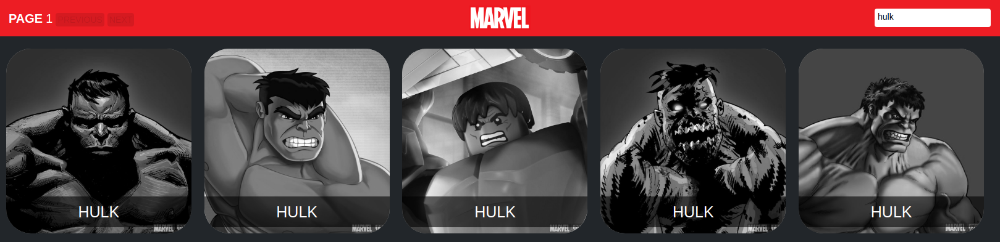
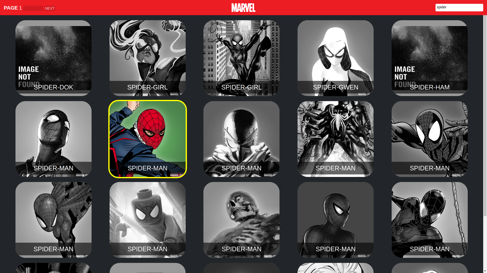
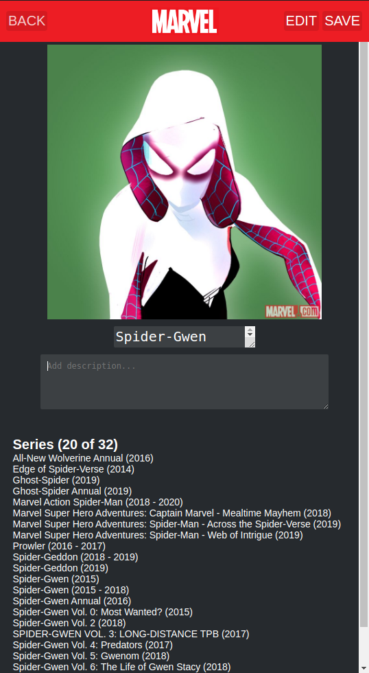

# Marvel API React.js front-end

This project uses react-redux, redux-saga, react-hooks, axios, styled-components and @testing-library/react and Marvel Official API to create this awesome Marvel Hero's App.

## Steps to run the project

In the project directory, enter the following commands:

1. `yarn install`
1. `yarn start`

Open [http://localhost:3000](http://localhost:3000) to view it in the browser.

## Testing the app

In the project directory, enter the following commands launches the test runner in the interactive watch mode.

1. `yarn test`

## App Routes

### List Screen

The hero list screen has components to change page and search for a specific hero by name.

[http://localhost:3000](http://localhost:3000)

### Hero Screen

The hero screen has components to edit and save changes on Hero's name and description.

[http://localhost:3000/hero/1017603](http://localhost:3000/hero/1017603)

